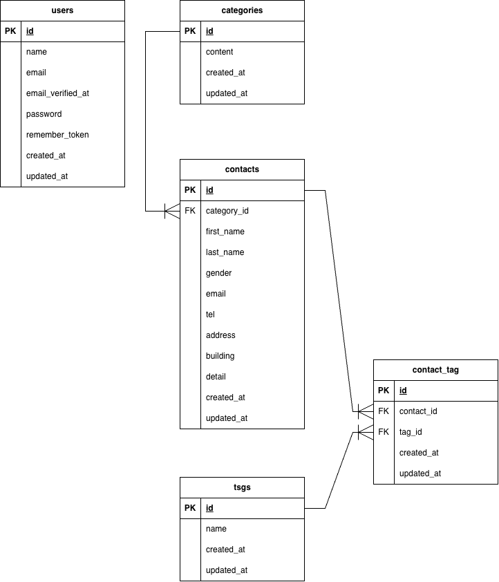

# Contact Form App

## 概要

Laravel 10.xを使用したお問い合わせフォームアプリケーションです。

## 使用技術

- PHP 8.2
- Laravel 10.x
- MySQL 8.0
- Nginx
- Vite
- Tailwind CSS
- Docker
- Laravel Sail
- phpMyAdmin

## 環境構築

### 1. Laravelプロジェクトの作成

Laravel 10.xを指定してプロジェクトを作成

```bash
docker run --rm \
  -u "$(id -u):$(id -g)" \
  -v "$(pwd):/var/www/html" \
  -w /var/www/html \
  -e COMPOSER_CACHE_DIR=/tmp/composer_cache \
  laravelsail/php82-composer:latest \
  composer create-project laravel/laravel:^10.0 contact-form-app
```

### 2. Laravel Sailのセットアップ

**DockerコンテナからLaravel Sailをセットアップ**

```bash
docker run --rm \
 -u "$(id -u):$(id -g)" \
 -v "$(pwd):/var/www/html" \
 -w /var/www/html \
 -e COMPOSER_CACHE_DIR=/tmp/composer_cache \
 laravelsail/php82-composer:latest \
 composer require laravel/sail --dev
```

**MySQLを使用する構成でSailをセットアップ**

```bash
docker run --rm \
 -u "$(id -u):$(id -g)" \
 -v "$(pwd):/var/www/html" \
 -w /var/www/html \
 -e COMPOSER_CACHE_DIR=/tmp/composer_cache \
 laravelsail/php82-composer:latest \
 php artisan sail:install --with=mysql
```

### 3. PHP / Laravel / MySQLのバージョン確認

**※確認方法**

```bash
sail php --version
sail artisan --version
sail mysql --version
```

技術スタックが指定と異なった為、下記要領にてPHP/MySQLを変更

```text
compose.yamlを確認
↓
PHP 8.5 → 8.2
MySQL 8.4 → 8.0
↓
Dockerイメージを再ビルド
↓
コンテナ再起動
↓
バージョン確認
```

**MySQLのバージョン変更によるエラー**<br>
MySQL 8.4から8.0へ変更した際、既存のMySQLボリュームに8.4のデータが残っていたため、MySQLのダウングレードエラーが発生。下記コマンドでボリュームを削除し、再構築。

```bash
sail down -v
sail up -d
```

### 4. データベース接続確認

LaravelからMySQLへ接続できることを確認します。

```bash
sail artisan migrate
```

### 5. phpMyAdmin

phpMyAdminをDocker Composeに追加し、ブラウザからMySQLデータベースを確認

**追加したコード（MySQLと同じインデントへ）**

```yaml
phpmyadmin:
    image: "phpmyadmin:latest"
    ports:
        - "${FORWARD_PHPMYADMIN_PORT:-8080}:80"
    environment:
        PMA_HOST: mysql
        PMA_USER: "${DB_USERNAME}"
        PMA_PASSWORD: "${DB_PASSWORD}"
    networks:
        - sail
    depends_on:
        - mysql
```

### 6. フロントエンド環境

提供頂いたbladeファイルに伴い、Tailwind CSS及びAlpine.jsをインストール・設定

**Tailwind CSSのインストール**

```bash
sail npm install -D tailwindcss@^3.4.0 postcss autoprefixer
```

**Alpine.jsのインストール**

```bash
sail npm install alpinejs
```

**Tailwind CSSの設定ファイル作成**

```bash
sail npx tailwindcss init -p
```

**tailwind.config.jsの設定**

```js
/** @type {import("tailwindcss").Config */
export default {
    content: [
        "./resources/**/*.blade.php",
        "./resources/**/*.js",
        "./resources/**/*.vue",
    ],
    theme: {
        extend: {},
    },
    plugins: [],
};
```

**Bladeファイルの配置**<br>
提供されたBladeファイルをresourcesディレクトリへ配置

**Viteの起動**
※Vite：CSSやJavaScriptなどのフロントエンドファイルを監視・ビルドしてくれる開発用サーバー<br>
※**注意点**：CSS・JavaScriptなどのフロントエンド処理が発生する場合に、**別のターミナル**で起動する。

```bash
sail npm run dev
```

## ER図

users / categories / contacts / tags / contact_tag テーブルのリレーションを表したER図


